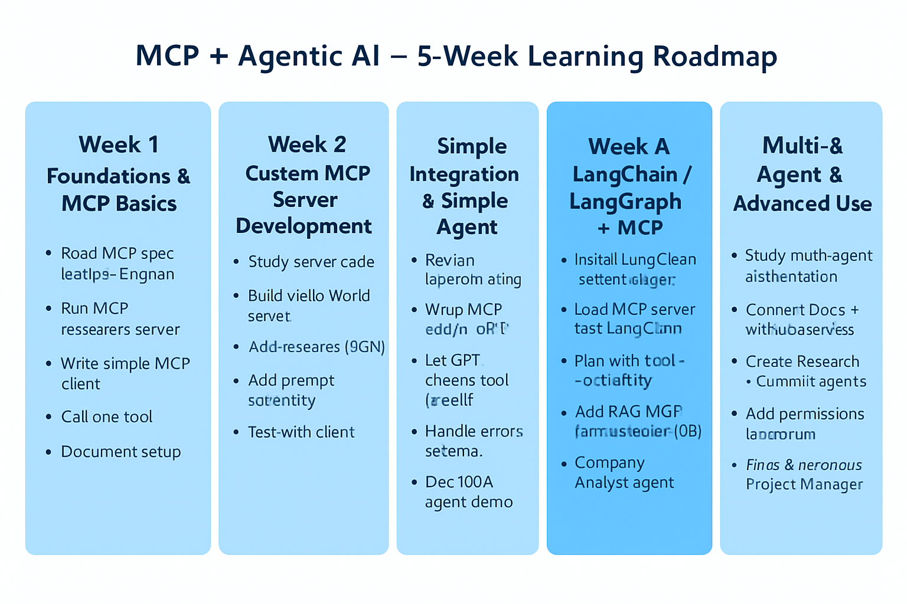

**5-week, hands-on learning path** for **MCP (Model Context Protocol)** with a focus on **building agentic AI**.  

---

## 📅 Week 1 – **Foundations & MCP Basics**

**Goal:** Understand MCP concepts, run a reference server, and make your first discovery call.

**Daily Plan:**

- **Day 1:**
  - Read [Anthropic MCP Overview](https://modelcontextprotocol.io) & [Spec](https://modelcontextprotocol.io/specification).
  - Draw your own diagram of MCP client ↔ server ↔ LLM.
- **Day 2:**
  - Install Python 3.11+ (or Node.js 18+) and Docker.
  - Clone MCP reference repo:
    ```bash
    git clone https://github.com/modelcontextprotocol/mcp
    ```
- **Day 3:**
  - Run the sample MCP file-server locally (Docker or Python).
  - Explore `/.well-known/mcp` endpoint to see capability JSON.
- **Day 4:**
  - Write a simple Python client that lists available **tools** from the server.  
    Example repo to study: [mcp-python-client-example](https://github.com/modelcontextprotocol/mcp-python-client-example)
- **Day 5:**
  - Add the ability to call **one tool** (e.g., “list files”) and print its output.
- **Weekend Task:**
  - Document your setup in a README.

---

## 📅 Week 2 – **Custom MCP Server Development**

**Goal:** Build your own MCP server exposing custom tools/resources.

**Daily Plan:**

- **Day 1:**
  - Study server code from `mcp` repo → look at how `tools` are defined.
- **Day 2:**
  - Build a **Hello World** MCP server with one tool: `say_hello(name)`.
- **Day 3:**
  - Add a **resource** type (e.g., a JSON file with mock company data).
- **Day 4:**
  - Add a **prompt** capability (e.g., “Summarize document” template).
- **Day 5:**
  - Test your client from Week 1 to discover & call your server’s tools/resources/prompts.
- **Weekend Task:**
  - Publish your server code to GitHub.

---

## 📅 Week 3 – **LLM Integration & Simple Agent**

**Goal:** Connect an LLM to your MCP client for dynamic tool use.

**Daily Plan:**

- **Day 1:**
  - Review OpenAI function calling docs ([OpenAI Cookbook](https://github.com/openai/openai-cookbook)).
- **Day 2:**
  - Wrap MCP tool calls in an **OpenAI GPT function-calling interface**.
- **Day 3:**
  - Let GPT **decide** which MCP tool to call (simple ReAct style).
- **Day 4:**
  - Implement error handling: retries, invalid params.
- **Day 5:**
  - Build a “Doc Q&A” agent: GPT picks a search tool, retrieves resource, summarizes it.
- **Weekend Task:**
  - Record a screen demo of your agent.

---

## 📅 Week 4 – **LangChain / LangGraph + MCP**

**Goal:** Use MCP in an agent framework for better planning/memory.

**Daily Plan:**

- **Day 1:**
  - Install LangChain + LangChain MCP adapter ([LangChain MCP Docs](https://docs.langchain.com/docs/integrations/toolkits/mcp)).
- **Day 2:**
  - Load your Week 2 MCP server into LangChain as tools.
- **Day 3:**
  - Create an agent that plans with MCP tools and uses memory (vector store).
- **Day 4:**
  - Add a **RAG MCP server** (vector DB as a resource).  
    Example: [ChromaDB MCP server repo](https://github.com/modelcontextprotocol/mcp-chromadb)
- **Day 5:**
  - Build a “Company Analyst” agent: queries DB via MCP, answers business questions.
- **Weekend Task:**
  - Deploy locally in a FastAPI/Streamlit app.

---

## 📅 Week 5 – **Multi-Agent & Advanced Use**

**Goal:** Orchestrate multiple agents and MCP servers, add governance.

**Daily Plan:**

- **Day 1:**
  - Study **CrewAI** or **LangGraph** multi-agent orchestration.
- **Day 2:**
  - Connect two MCP servers: e.g., Docs + GitHub.
- **Day 3:**
  - Create Agent A (Research) + Agent B (Code Commit) → pass results via MCP.
- **Day 4:**
  - Add **permissions & consent prompts** for sensitive tools.
- **Day 5:**
  - Write tests for your agent’s tool-calling logic.
- **Weekend Final Project:**
  - “Autonomous Project Manager” — takes a feature request, searches docs, edits code, opens PR, and posts update to Slack — all via MCP.

---

## 📦 Key Repos to Clone & Learn From

1. **Official MCP Spec & Reference:**  
   [github.com/modelcontextprotocol/mcp](https://github.com/modelcontextprotocol/mcp)
2. **Python MCP Client Example:**  
   [github.com/modelcontextprotocol/mcp-python-client-example](https://github.com/modelcontextprotocol/mcp-python-client-example)
3. **LangChain MCP Adapter:**  
   [github.com/langchain-ai/langchain/tree/master/libs/langchain/langchain/mcp](https://github.com/langchain-ai/langchain/tree/master/libs/langchain/langchain/mcp)
4. **Example MCP Servers (GitHub, FS, ChromaDB):**  
   [github.com/modelcontextprotocol/mcp-servers](https://github.com/modelcontextprotocol/mcp-servers)
5. **Anthropic Claude MCP Docs:**  
   [modelcontextprotocol.io](https://modelcontextprotocol.io)

---

## Visual Roadmap

# MCP + Agentic AI 5-Week Learning Roadmap ✅

## Week 1 - Foundations & MCP Basics
- [x] Read MCP spec & draw diagram
- [x] Run MCP reference server
- [ ] Write simple MCP client
- [ ] Call one tool
- [ ] Document setup

## Week 2 - Custom MCP Server
- [ ] Study server code
- [ ] Build Hello World server
- [ ] Add resource
- [ ] Add prompt
- [ ] Test with client

## Week 3 - LLM Integration & Simple Agent
- [ ] Review function calling
- [ ] Wrap MCP calls in GPT
- [ ] Let GPT choose tool
- [ ] Handle errors
- [ ] Doc Q&A agent

## Week 4 - LangChain / LangGraph + MCP
- [ ] Install LangChain + MCP
- [ ] Load server into LangChain
- [ ] Plan with tools + memory
- [ ] Add RAG MCP server
- [ ] Company Analyst agent

## Week 5 - Multi-Agent & Advanced Use
- [ ] Study multi-agent orchestration
- [ ] Connect two MCP servers
- [ ] Create 2 cooperating agents
- [ ] Add permissions & consent
- [ ] Final Project: Autonomous PM



